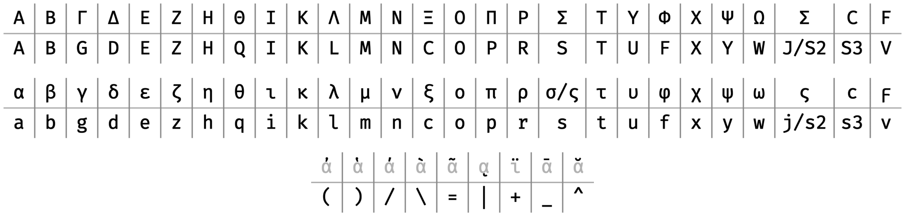

VSCode-BetaCode
================

Type [polytonic Greek][polytonic] into [VS Code][vscode].

Character mapping
-----------------

The character mapping is based on [Beta Code][beta_code].



But it differs from Beta Code in that:

* Asterisk prefix is not needed for capitals: `d` → `δ`, `D` → `Δ`. Using asterisks, however, is also supported: `*d` → `Δ`.
* Final sigmas are used automatically when fit: `su/nacis` → `σύναξις`. Final sigma (`ς`) can also be generated with `j`: `su/nacij` → `σύναξις`.
* Macron is mapped to underscore: `a_` → `ᾱ`.
* Vrachy (breve) is mapped to circumflex: `a^` → `ᾰ`.
* Dialytika (diæresis) is mapped to plus sign: `i+` → `ϊ`.
* Ano teleia (raised point) is mapped to colon: `:` → `·`.

Example usage
-------------

[The Lord’s Prayer][lords_prayer]:

```
Pa/ter h(mw=n o( e)n toi=s ou)ranoi=s:
a(giasqh/tw to\ o)/noma/ sou:
e)lqe/tw h( basilei/a sou:
genhqh/tw to\ qe/lhma/ sou, w(s e)n ou)ranw=|, kai\ e)pi\ th=s gh=s:
to\n a)/rton h(mw=n to\n e)piou/sion do\s h(mi=n sh/meron:
kai\ a)/fes h(mi=n ta\ o)feilh/mata h(mw=n,
w(s kai\ h(mei=s a)fi/emen toi=s o)feile/tais h(mw=n:
kai\ mh\ ei)sene/gkh|s h(ma=s ei)s peirasmo/n,
a)lla\ r(u=sai h(ma=s a)po\ tou= ponhrou=.
A)mh/n.
```

Becomes:

```
Πάτερ ἡμῶν ὁ ἐν τοῖς οὐρανοῖς·
ἁγιασθήτω τὸ ὄνομά σου·
ἐλθέτω ἡ βασιλεία σου·
γενηθήτω τὸ θέλημά σου, ὡς ἐν οὐρανῷ, καὶ ἐπὶ τῆς γῆς·
τὸν ἄρτον ἡμῶν τὸν ἐπιούσιον δὸς ἡμῖν σήμερον·
καὶ ἄφες ἡμῖν τὰ ὀφειλήματα ἡμῶν,
ὡς καὶ ἡμεῖς ἀφίεμεν τοῖς ὀφειλέταις ἡμῶν·
καὶ μὴ εἰσενέγκῃς ἡμᾶς εἰς πειρασμόν,
ἀλλὰ ῥῦσαι ἡμᾶς ἀπὸ τοῦ πονηροῦ.
Ἀμήν.
```

Credits & License
-----------------
VSCode-BetaCode is written by [André Kugland][kuglandml] and licensed under
the [GPLv3][gplv3].

[polytonic]: https://en.wikipedia.org/wiki/Greek_diacritics
[vscode]: https://code.visualstudio.com/
[beta_code]: https://en.wikipedia.org/wiki/Beta_code
[lords_prayer]: https://en.wikipedia.org/wiki/Lord%27s_Prayer
[kuglandml]: mailto:kugland@gmail.com
[gplv3]: https://www.gnu.org/licenses/gpl-3.0-standalone.html
