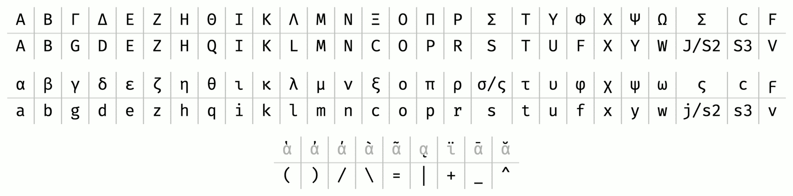

VSCode-BetaCode
================

A plugin that allows typing [polytonic Greek][polytonic] into [VS Code][vscode].

Character mapping
-----------------

Its syntax is based on [Beta Code][beta_code], but it differs from it in that:

* Asterisk prefix is not needed for capitals, i.e. ‘d’ → ‘δ’, ‘D’ → ‘Δ’,
  but using it is also supported.
* Final sigmas are used automatically when fit, but ‘j’ is also mapped to final
  sigma.
* Macron is ‘_’, breve is ‘^’ and diæresis is ‘+’.
* ‘:’ becomes ‘·’.



Example usage (Lord’s Prayer)
-----------------------------

```
Pa/ter h(mw=n o( e)n toi=s ou)ranoi=s:
a(giasqh/tw to\ o)/noma/ sou:
e)lqe/tw h( basilei/a sou:
genhqh/tw to\ qe/lhma/ sou, w(s e)n ou)ranw=|, kai\ e)pi\ th=s gh=s:
to\n a)/rton h(mw=n to\n e)piou/sion do\s h(mi=n sh/meron:
kai\ a)/fes h(mi=n ta\ o)feilh/mata h(mw=n,
w(s kai\ h(mei=s a)fi/emen toi=s o)feile/tais h(mw=n:
kai\ mh\ ei)sene/gkh|s h(ma=s ei)s peirasmo/n,
a)lla\ r(u=sai h(ma=s a)po\ tou= ponhrou=.
A)mh/n.
```

Becomes:

```
Πάτερ ἡμῶν ὁ ἐν τοῖς οὐρανοῖς·
ἁγιασθήτω τὸ ὄνομά σου·
ἐλθέτω ἡ βασιλεία σου·
γενηθήτω τὸ θέλημά σου, ὡς ἐν οὐρανῷ, καὶ ἐπὶ τῆς γῆς·
τὸν ἄρτον ἡμῶν τὸν ἐπιούσιον δὸς ἡμῖν σήμερον·
καὶ ἄφες ἡμῖν τὰ ὀφειλήματα ἡμῶν,
ὡς καὶ ἡμεῖς ἀφίεμεν τοῖς ὀφειλέταις ἡμῶν·
καὶ μὴ εἰσενέγκῃς ἡμᾶς εἰς πειρασμόν,
ἀλλὰ ῥῦσαι ἡμᾶς ἀπὸ τοῦ πονηροῦ.
Ἀμήν.
```

Credits & License
-----------------
VSCode-BetaCode is written by [André Kugland][kuglandml] and licensed
under the [GPLv3][gplv3].

[polytonic]: https://en.wikipedia.org/wiki/Greek_diacritics
[vscode]: https://code.visualstudio.com/
[beta_code]: https://en.wikipedia.org/wiki/Beta_code
[lords_prayer]: https://en.wikipedia.org/wiki/Lord%27s_Prayer
[kuglandml]: mailto:kugland@gmail.com
[gplv3]: https://www.gnu.org/licenses/gpl-3.0-standalone.html
